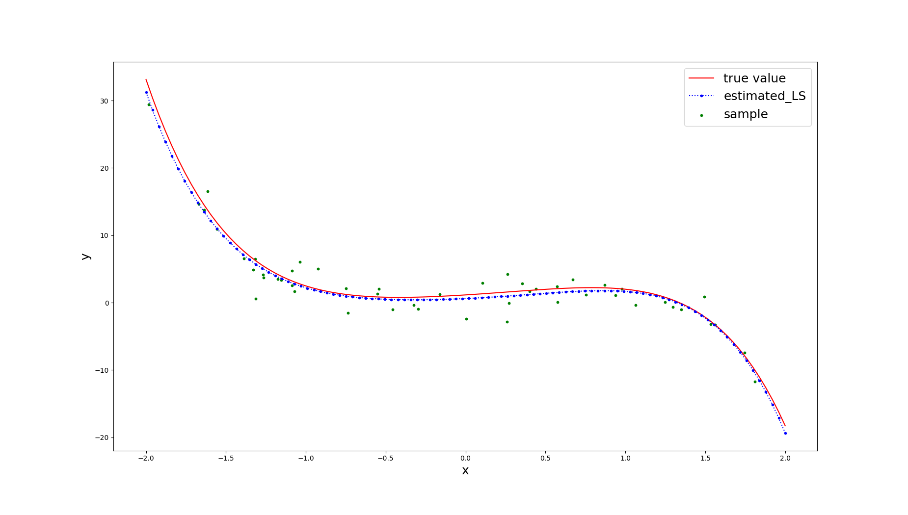
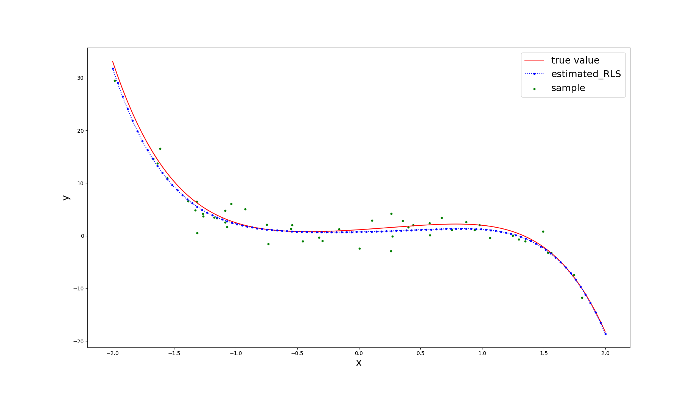
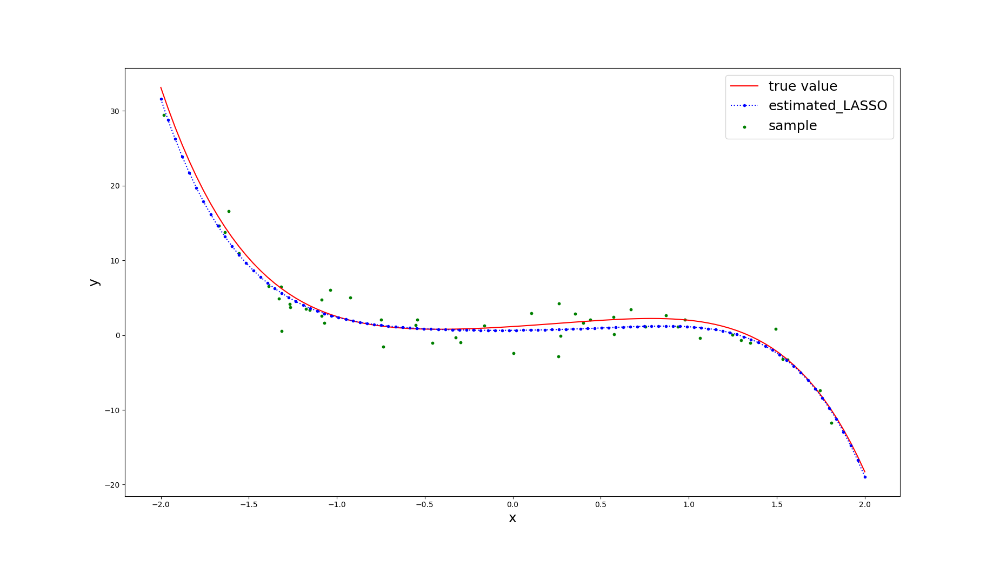
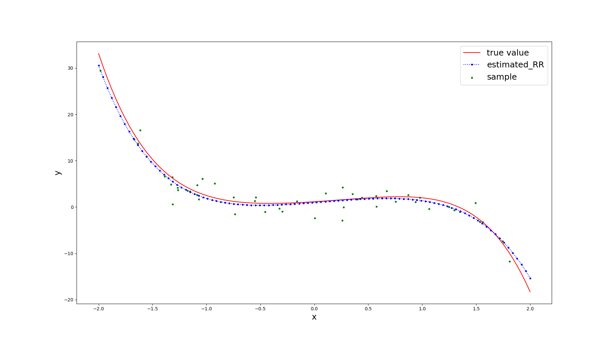
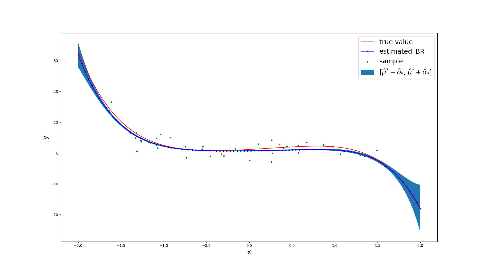

# My implementation of regression models

This is the implementation of the five regression methods
Least Square (LS), Regularized Least Square (RLS), LASSO, Robust Regression (RR) and Bayesian
Regression (BR). We use simple. We use simulated data as shown in figure below. The red line is the true function and the black dot is the simulated data points.

* [Least Square](https://en.wikipedia.org/wiki/Least_squares)

* [Regularized Least Square](https://en.wikipedia.org/wiki/Regularized_least_squares)

* [LASSO](https://en.wikipedia.org/wiki/Lasso_(statistics))

* [Robust Regression](https://en.wikipedia.org/wiki/Robust_regression)

* [Bayesian Regression](https://en.wikipedia.org/wiki/Bayesian_linear_regression)

